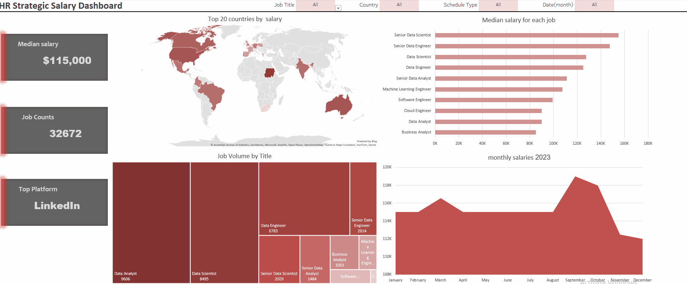
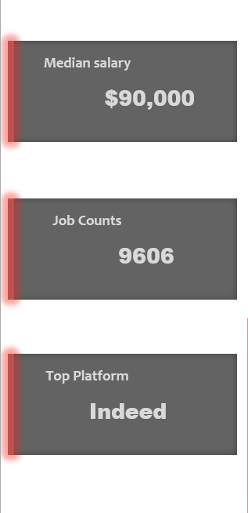

# HR Strategic Salary Dashboard


***The Problem:***  
Raw, uninterpreted salary datasets of 32,000+ records are impossible to query or extract direct strategic insights from manually. Attempting to filter and analyze this volume across multiple criteria in Excel typically causes severe computation bottlenecks and rendering delays. 


***The Solution:***  
I designed a 4-layer architecture `Data → Validation → Calculations → Dashboard` to separate concerns and keep the model organized. By isolating the raw rows from the visual layer, I connected everything using dynamic Excel formulas and Boolean logic. This built an interactive dashboard with dynamic filters that simplifies the data visuals, making it easy for decision-makers to get instant insights without dealing with complex background rows.


***Tools & Tech Stack:***
*   **Microsoft Excel 365:** The platform used to build the data model and visuals.
*   **Dynamic Array Formulas:** Used functions like `FILTER`, `ROWS`, `MEDIAN`, and `IFERROR` for calculations.
*   **Boolean Logic:** Multiplied conditions directly within formulas to filter the 32k rows.

*Note: This project focuses strictly on Excel's core formulas and functions as part of my current learning path. Advanced internal tools like Power Query or Power Pivot will be applied in future projects.*


##  Dashboard in Action

*The entire dashboard operates on a dynamic filtering system. The moment you select any criteria from the top dropdowns, all metrics, calculations, and visual charts filter and update instantly.*


##  Dashboard Component Analysis

### 1. Dynamic Control Panel (Filters)

*This panel uses Data Validation to create clean dropdown menus. This ensures users can only select valid options, preventing manual input errors from breaking the background formulas and calculations.*

### 2. Executive Summary (KPI Cards)


*These cards display key metrics like Median Salary and Job Counts. They use dynamic arrays and Boolean logic to calculate statistics instantly based on your filter selections.*

#### Core Formulas Used:

*   **Median Salary Card:** Uses `FILTER` and `MEDIAN` combined with Boolean multiplication to bypass empty rows and calculate the true middle salary:
```excel
    =IFERROR(MEDIAN(
     FILTER(
     Jobs[salary_year_avg],
       (("All"=Jobtitle)+(Jobtitle=Jobs[job_title_short]))*
       (("All"=Country)+(Country=Jobs[job_country]))*
       (("All"=ScheduleType)+ISNUMBER(FIND(ScheduleType,Jobs[job_schedule_type])))*
       (("All"=month)+(month=Jobs[Month]))
     )
     ),"No result")

```

*   **Job Counts Card:** Dynamically counts the filtered rows using `COUNTA` to show the exact number of job roles matching the criteria:
```excel
    =COUNTA(FILTER(Jobs[job_title_short],
       (("All"=Jobtitle)+(Jobtitle=Jobs[job_title_short]))*
       (("All"=Country)+(Country=Jobs[job_country]))*
       (("All"=ScheduleType)+ISNUMBER(FIND(ScheduleType,Jobs[job_schedule_type])))*
       (("All"=month)+(month=Jobs[Month]))))
```


### 3. Geospatial Analysis (Top Countries by Salary)

  *This map displays the top 20 countries based on median salary. I intentionally limited the visualization to the top 20 to optimize the map's rendering speed, ensuring a fast and smooth user experience when switching filters.*


### 4. Market Demand (Job Volume by Title)

  *This treemap shows the distribution of job counts across different roles. I chose a Treemap here because it cleanly displays a high number of job titles in a single, compact space, allowing decision-makers to spot the most in-demand roles instantly.*


### 5. Compensation Benchmarking (Median Salary)

  *This horizontal bar chart compares median salaries across different roles. I implemented a dynamic conditional formatting rule so that whichever job title is currently selected in the top filter automatically highlights in a darker, distinct color, making benchmarking instant and visually striking.*


### 6. Temporal Trends (Monthly Salaries 2023)

  *This area chart tracks salary and hiring trends month-by-month throughout the year. I used an Area Chart to visually highlight the peaks and valleys, making it easy for companies to identify hiring seasons and peak market activity at a glance.*
  ----
 

##  What's Next

To further scale and improve this project, the next phases will focus on:
*   **Performance Optimization:** Migrating the background calculation layer to Power Query and Power Pivot to reduce workbook size and eliminate formula recalculation lags.
*   **Advanced Market Insights:** Expanding the data model to include a skills demand analysis, tracking the most requested tools and certifications for each data role.
*   **Global Compensation Normalization:** Incorporating cost-of-living indices and purchasing power data across the 57 countries to provide deeper, more accurate cross-border salary comparisons.
