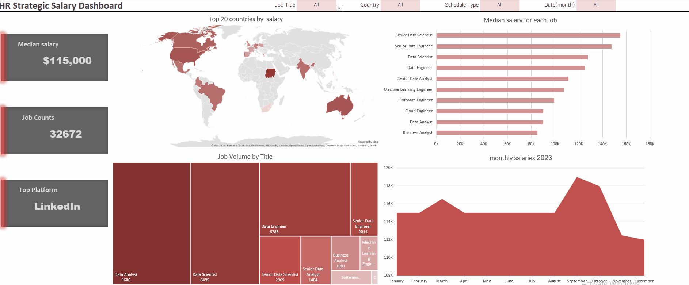

# HR Strategic Salary Dashboard


***The Problem:***  
32,000+ salary records sitting in a flat table tell you nothing on their own. Filtering across job title, country, schedule type, and month manually in Excel isn't just slow — at this scale, it breaks.

***The Solution:***  
I split the workbook into 4 sheets: ` Data → Validation → Calculations → Dashboard `The idea was simple: keep the raw data completely separate from anything visual, and let formulas do all the work in between. Every number on the dashboard is pulled live — no hardcoded values, no manual refreshes.

***Tools & Tech Stack:***
*   **Microsoft Excel 365:** The only tool used — no Power Query, no Power Pivot, no VBA.
*   **Dynamic Array Formulas:** Used functions like `FILTER`, `ROWS`, `MEDIAN`, and `IFERROR` for calculations.
*   **Boolean Logic:**Conditions multiplied directly inside formulas to filter all 32k rows on the fly.

This project is part of my Excel learning path. I kept it intentionally limited to core formulas — Power Query and Power Pivot are next.


##  Dashboard in Action

*The entire dashboard operates on a dynamic filtering system. The moment you select any criteria from the top dropdowns, all metrics, calculations, and visual charts filter and update instantly.*


##  Dashboard Component Analysis

### 1. Dynamic Control Panel (Filters)

*This panel uses Data Validation to create clean dropdown menus. This ensures users can only select valid options, preventing manual input errors from breaking the background formulas and calculations.*

### 2. Executive Summary (KPI Cards)


*These cards display key metrics like Median Salary and Job Counts. They use dynamic arrays and Boolean logic to calculate statistics instantly based on your filter selections.*

#### Core Formulas Used:

*   **Median Salary Card:** Uses `FILTER` and `MEDIAN` combined with Boolean multiplication to bypass empty rows and calculate the true middle salary:
```excel
    =IFERROR(MEDIAN(
     FILTER(
     Jobs[salary_year_avg],
       (("All"=Jobtitle)+(Jobtitle=Jobs[job_title_short]))*
       (("All"=Country)+(Country=Jobs[job_country]))*
       (("All"=ScheduleType)+ISNUMBER(FIND(ScheduleType,Jobs[job_schedule_type])))*
       (("All"=month)+(month=Jobs[Month]))
     )
     ),"No result")

```

*   **Job Counts Card:** Dynamically counts the filtered rows using `COUNTA` to show the exact number of job roles matching the criteria:
```excel
    =COUNTA(FILTER(Jobs[job_title_short],
       (("All"=Jobtitle)+(Jobtitle=Jobs[job_title_short]))*
       (("All"=Country)+(Country=Jobs[job_country]))*
       (("All"=ScheduleType)+ISNUMBER(FIND(ScheduleType,Jobs[job_schedule_type])))*
       (("All"=month)+(month=Jobs[Month]))))
```


### 3. Top 20 Countries Map 

  *This map displays the top 20 countries based on median salary. I intentionally limited the visualization to the top 20 to optimize the map's rendering speed, ensuring a fast and smooth user experience when switching filters.*


### 4. Job Volume Treemap

  *This treemap shows the distribution of job counts across different roles. I chose a Treemap here because it cleanly displays a high number of job titles in a single, compact space, allowing decision-makers to spot the most in-demand roles instantly.*


### 5. Median Salary Bar Chart

  *This horizontal bar chart compares median salaries across different roles. I implemented a dynamic conditional formatting rule so that whichever job title is currently selected in the top filter automatically highlights in a darker, distinct color, making benchmarking instant and visually striking.*


### 6. Temporal Trends (Monthly Salaries 2023)

  *This area chart tracks salary and hiring trends month-by-month throughout the year. I used an Area Chart to visually highlight the peaks and valleys, making it easy for companies to identify hiring seasons and peak market activity at a glance.*
  ----
 

##  What's Next

* Migrate to Power Query + Power Pivot — the formula layer works, but recalculation on 32k rows has a cost. Moving the heavy lifting out of sheet formulas should fix that.
* Skills demand layer — the dataset includes a job_skills column I haven't touched yet. Analyzing which tools and certifications appear most per role is the obvious next step.
* Cost-of-living adjustment — median salary in the US and median salary in Pakistan are different numbers entirely once you account for purchasing power. Adding a normalization layer would make the country comparison actually meaningful.
